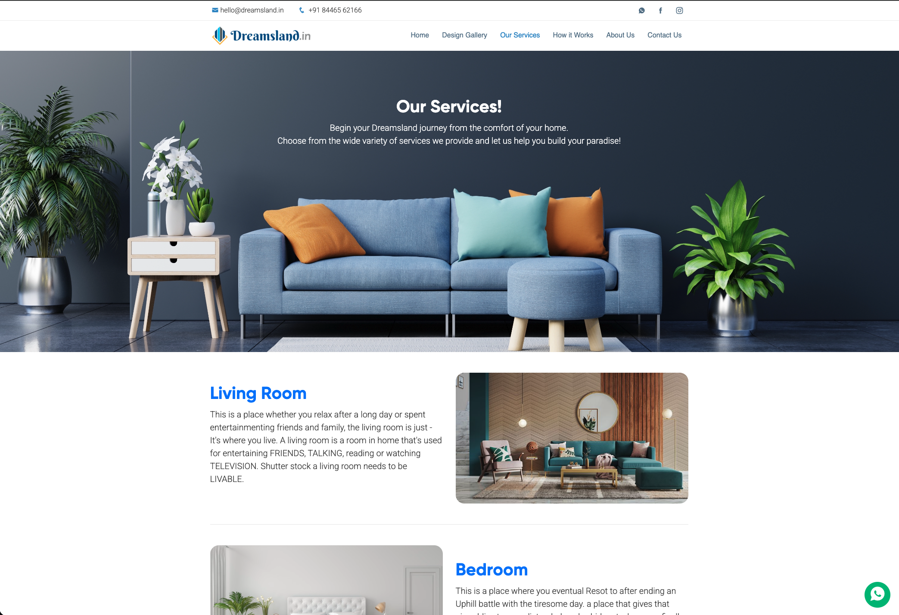

# Dreamsland Interiors

A marketing website for Dreamsland Interiors, an end-to-end interior design studio.

The site introduces the studio and walks a visitor from first impression to enquiry: what Dreamsland does, the range of work it takes on, how a project actually unfolds, and how to get in touch.

## Pages

- **Home** — the studio's pitch, what sets it apart, and a look at the full service range.
- **Services** — the individual offerings, from modular kitchens and wardrobes to false ceilings, wall painting, wall decor and CNC cutting.
- **Works** — how a project runs, step by step, from first consultation to handover.
- **Gallery** — completed interiors and design concepts across room types.
- **Contact** — enquiry details for starting a project.

## About the project

A static, multi-page site built with plain HTML, CSS and JavaScript — no build step and no backend. It is designed to be hosted directly from this repository.

Built by [ByteWeave.Studio](mailto:contact.skillconnect@gmail.com).
